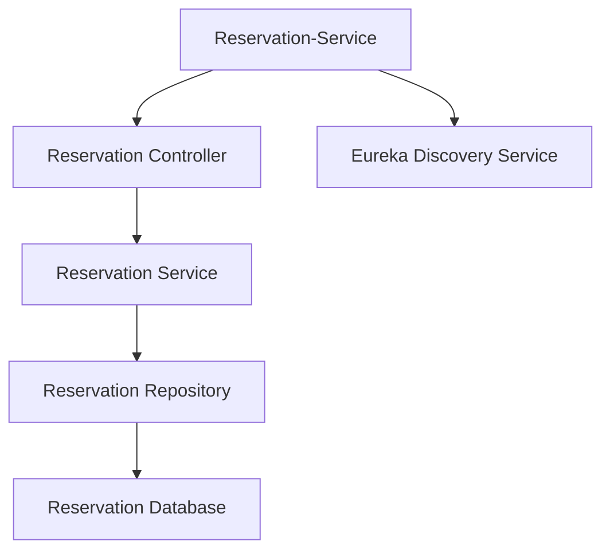
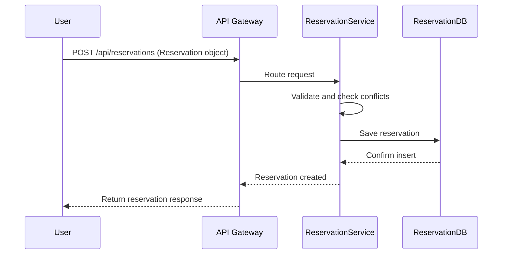

# Reservation-Service Module Low-Level Documentation

This document provides a low-level overview of the `Reservation-Service` module, a microservice within the Parking Management System (PMS) responsible for managing parking slot reservations.

---

## Table of Contents

1. [Project Overview](#1-project-overview)  
   - [Features](#features)

2. [Architecture](#2-architecture)  
   - [High-Level Architecture](#21-high-level-architecture)  
   - [Layered Architecture Diagram](#22-layered-architecture-diagram)  
   - [Technologies Used](#23-technologies-used)

3. [Database Design](#3-database-design)  
   - [Reservation Table](#31-reservation-table)

4. [API Endpoints](#4-api-endpoints)  
   - [Reservation Management](#41-reservation-management)  
   - [Sequence Diagram](#42-sequence-diagram)  
   - [Swagger Documentation](#43-swagger-documentation)

5. [Error Handling](#5-error-handling)

6. [Dependencies](#6-dependencies)

7. [Deployment](#7-deployment)

---

## 1. Project Overview

The `Reservation-Service` module is a critical component of the PMS, enabling users to create, update, view, and cancel parking slot reservations. It ensures data integrity, prevents double bookings, and works seamlessly with user and slot management services.

### Features

- **Create Reservations**
  - Accepts requests to book a parking slot for a specific time frame.
  - Validates availability before creating a record.
  - Prevents overlapping reservations for the same slot.

- **View Reservations**
  - Fetch reservations by user ID or reservation ID.
  - Supports filtering and sorting for better usability.

- **Update Reservations**
  - Allows modification of slot, time window, or vehicle number.
  - Validates updated data to avoid conflicts.

- **Cancel Reservations**
  - Allows users to cancel an existing reservation.
  - Updates reservation status accordingly by checking slot availability.

---

## 2. Architecture

### 2.1 High-Level Architecture

The `Reservation-Service` follows a **layered architecture** using **Spring Boot** and communicates with other PMS modules via REST APIs. The service relies on a relational database (e.g., MySQL or H2) to manage persistence.

### 2.2 Layered Architecture Diagram


### 2.3 Technologies Used

- **Framework:** Spring Boot  
- **Database:** H2 / MySQL  
- **Language:** Java  
- **Build Tool:** Maven

---

## 3. Database Design

### 3.1 Reservation Table

| Column Name       | Data Type  | Description                             |
|-------------------|------------|-----------------------------------------|
| `reservation_id`  | bigint     | Primary key, auto-generated             |
| `user_id`         | bigint     | Foreign key to User table               |
| `slot_id`         | bigint     | Foreign key to ParkingSlot table        |
| `vehicle_number`  | varchar    | Vehicle registration number             |
| `start_time`      | datetime   | Reservation start time                  |
| `end_time`        | datetime   | Reservation end time                    |
| `status`          | varchar    | Reservation status (e.g., Active, Canceled) |

---

## 4. API Endpoints

### 4.1 Reservation Management

| Endpoint                                | Method  | Description                      | Request/Params                          |
|-----------------------------------------|---------|----------------------------------|------------------------------------------|
| `/api/reservations`                     | POST    | Create a new reservation         | Reservation object (JSON)               |
| `/api/reservations/user/{userId}`       | GET     | Get reservations for a user      | `userId` as path variable                |
| `/api/reservations/{id}`                | GET     | Get reservation by ID            | `id` as path variable                    |
| `/api/reservations/{id}`                | PUT     | Update an existing reservation   | Updated fields in request body          |
| `/api/reservations/{id}`                | DELETE  | Cancel a reservation             | `id` as path variable                    |

---

### 4.2 Sequence Diagram


### 4.3 Swagger Documentation

Comprehensive API documentation is available via Swagger UI, typically accessible at:  
[**http://localhost:8080/swagger-ui.html**](http://localhost:8080/swagger-ui.html)


---

## 5. Error Handling

The module uses Spring Boot's global exception handling mechanisms to ensure consistent and descriptive error responses.

| HTTP Status Code | Description                          |
|------------------|--------------------------------------|
| `400 Bad Request`| Invalid input or request parameters  |
| `404 Not Found`  | Reservation does not exist           |
| `409 Conflict`   | Overlapping reservation or slot issue|
| `500 Internal Server Error` | Unexpected server-side failure |

All error responses include a message and timestamp, aiding in debugging and user communication.

---

## 6. Dependencies

- `spring-boot-starter-web`: For building REST APIs  
- `spring-boot-starter-data-jpa`: ORM and data persistence  
- `spring-boot-starter-validation`: Input validation  
- `H2` or `MySQL` driver: Database connectivity  
- `lombok`: For minimizing boilerplate code  
- `junit`, `mockito`: Unit and integration testing

---

## 7. Deployment

The `Reservation-Service` module can be run locally or deployed as a Docker container. It registers with Eureka for service discovery and can scale independently within a microservices ecosystem.

### Key Configuration

```properties
spring.application.name=reservation-service
server.port=8020

spring.datasource.url=jdbc:h2:file:./data/reservationDB;DB_CLOSE_DELAY=-1
spring.datasource.driver-class-name=org.h2.Driver
spring.datasource.username=sa
spring.datasource.password=

spring.jpa.hibernate.ddl-auto=update
spring.jpa.show-sql=true
